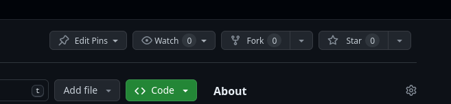

# Web-24-Tasks

  - ## How to Upload?
    - fork this repo (by clicking on the "Fork" button).
    
    - and this window will appear.
    
    - uncheck on (Copy the main branch only) checkbox.
    - then "Create fork" button.
    - now you have a copied repo from tasks repo on your account. clone the copied repo and work on it.
  ----------------------

  - ## Before Working
    - go to "Members" folder and get inside the folder named with your name.
    - then create a new folder named "Task i" where i is the task number
    - then open the created folder and start working.

  ----------------------
  - ## How to Submit the tasks?
    - after working on your changes push it to the copied repo and make a pull request (by ckicking the "Pull requests" button)  
    
    - then click on "New pull request" button.
    
    - then click on the "Create pull request" button.
    
    - click the "Creat pull reqeuest" button again
    - Done :wilted_flower:, Congrants you submitted your task.

