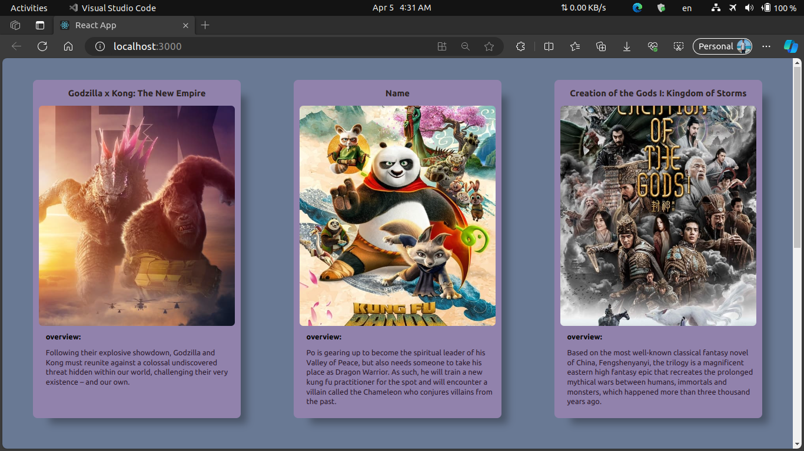

# Task 2

- moviesData.js file uploaded to the repository.
- fetch moviesData using a loop.
- create at least 2 components (Parent and Child).
- Parent component passes movie data to child component.
- use the ternary operator to replace missing data (Conditional Rendering).
- title is required.
- posterPath defined in moviesData.js.
- use uuid for key.
- use CSS Modules.
- bonus for best CSS or responsive design.

exapmle for output:

Deadline: 9/4 11:59 PM

I will be pleased to help you all anytime.

Good luck 🍀
